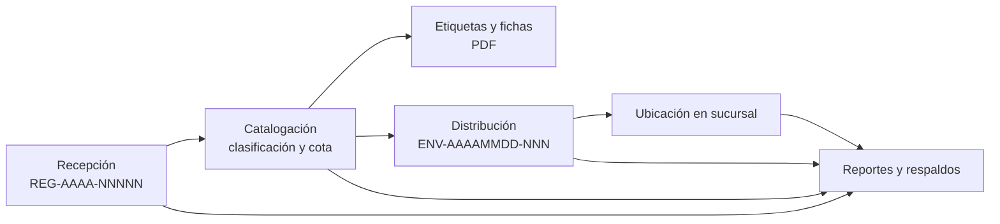
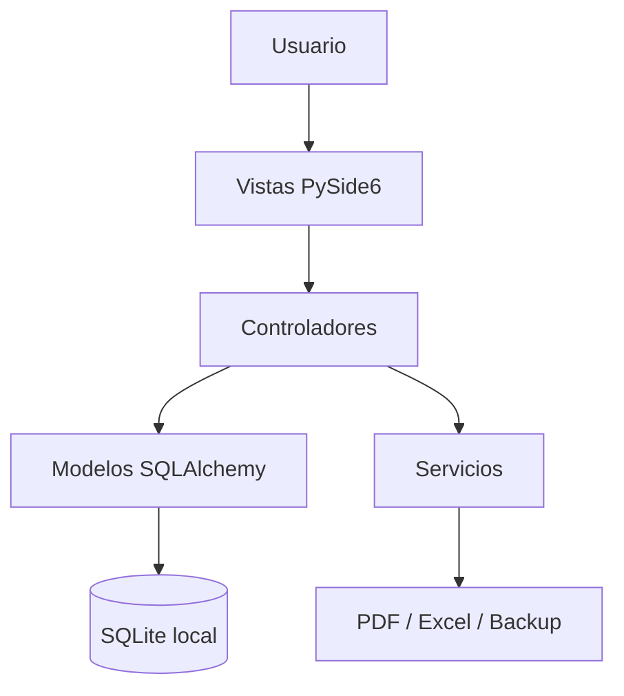

# Sistema de Gestión Bibliotecaria Central Rómulo Gallegos

## Documento descriptivo y base para proyecto de grado

**Título propuesto:** Sistema portable de gestión bibliotecaria para la recepción, procesamiento técnico y distribución de libros entre una biblioteca central y sus sucursales 
**Área:** Ingeniería de software / Sistemas de información 
**Institución:** [Nombre de la universidad] 
**Facultad y programa:** [Facultad] / Licenciatura en Informática 
**Autor(a):** [Nombre completo] 
**Tutor(a):** [Nombre y grado académico] 
**Lugar y fecha:** [Ciudad, país, año]

> Este documento describe la versión actual del software y propone una estructura académica para presentarlo como proyecto de grado. Debe completarse con los datos institucionales, normas de estilo, evidencias de campo y validaciones que exija la universidad. No sustituye la aprobación del tutor ni afirma resultados de pruebas que aún no se han ejecutado.

## Resumen

La Biblioteca Central Rómulo Gallegos cumple funciones de recepción, catalogación, almacenamiento temporal y distribución de libros a bibliotecas sucursales. Cuando estas actividades se registran manualmente, aumenta el riesgo de duplicidad, pérdida de trazabilidad, errores en la identificación de ejemplares y dificultad para conocer el inventario disponible en cada sede. Este proyecto desarrolla una aplicación de escritorio portable para apoyar ese flujo mediante una base de datos local, módulos de operación bibliotecaria y generación de documentos.

La solución utiliza Python y PySide6 para la interfaz gráfica, SQLAlchemy como capa de persistencia sobre SQLite, ReportLab para documentos PDF y openpyxl para hojas de cálculo. Su arquitectura separa vistas, controladores, modelos persistentes y servicios auxiliares. El flujo principal registra los libros con un número de control, permite asignar clasificación y cota, genera etiquetas y fichas, y registra los envíos a sucursales junto con movimientos y ubicaciones. También incorpora autenticación, roles, reportes y respaldos locales.

La aplicación está orientada a funcionar sin conexión a Internet y a mantener sus datos en una carpeta portable. En la versión actual, la suite automatizada contiene diez pruebas aprobadas en el entorno de desarrollo. La generación del paquete ejecutable y la validación física de impresión deben comprobarse en equipos Windows y Linux de destino antes de una distribución institucional.

**Palabras clave:** biblioteca, inventario, catalogación, SQLite, aplicación portable, MVC, trazabilidad.

## 1. Introducción

Las bibliotecas centrales que abastecen varias sedes necesitan controlar no sólo la cantidad de libros recibidos, sino también su estado de procesamiento, signatura topográfica, ubicación y destino. La información debe mantenerse coherente desde que se registra un ingreso hasta que el material se entrega a una sucursal.

El proyecto propone una herramienta de escritorio para apoyar estas actividades desde una interfaz común. Se priorizan el funcionamiento sin conexión, la trazabilidad de las operaciones, la exportación de documentos y la posibilidad de trasladar la aplicación junto con su base de datos en medios portables.

## 2. Planteamiento del problema

### 2.1 Situación problemática

El registro manual o disperso de ingresos, catalogaciones y envíos puede producir datos incompletos, registros duplicados y diferencias entre el inventario registrado y la ubicación física. La preparación manual de etiquetas, fichas, documentos de envío y estadísticas también consume tiempo operativo y dificulta reconstruir el historial de un libro.

### 2.2 Pregunta orientadora

¿Cómo puede una aplicación de escritorio portable apoyar el control del flujo de libros de la Biblioteca Central Rómulo Gallegos, desde la recepción hasta la distribución a sus sucursales, conservando información consultable y trazable sin depender de una conexión a Internet?

### 2.3 Justificación

La digitalización de las operaciones permite centralizar los datos bibliográficos, reducir la repetición de captura y consultar el estado y la ubicación de los libros. La automatización de números de registro, códigos de envío, documentos y respaldos ofrece una base de trabajo más consistente. SQLite evita depender de un servidor de base de datos, mientras que una interfaz gráfica permite que el personal opere el sistema sin utilizar comandos.

## 3. Objetivos

### 3.1 Objetivo general

Desarrollar una aplicación de escritorio portable para gestionar el registro, procesamiento técnico, ubicación y distribución de libros de la Biblioteca Central Rómulo Gallegos y sus sucursales.

### 3.2 Objetivos específicos

1. Modelar la información bibliográfica, los ingresos, las catalogaciones, las bibliotecas, las ubicaciones, los envíos, los usuarios y los movimientos.
2. Implementar el flujo de recepción, catalogación y distribución con validaciones y cambios de estado controlados.
3. Proporcionar consultas de inventario e historial que permitan localizar libros por sus principales identificadores.
4. Generar etiquetas, fichas catalográficas, documentos de envío, reportes y respaldos en formatos portables.
5. Incorporar autenticación y autorización para separar las funciones de administración de las funciones operativas.
6. Verificar las reglas de negocio mediante pruebas automatizadas y preparar la aplicación para su empaquetado en los sistemas de destino.

## 4. Alcance y delimitaciones

### 4.1 Incluido

- Inicio de sesión y cambio obligatorio de la contraseña inicial.
- Registro, búsqueda y corrección auditada de recepciones.
- Catalogación con clasificación Dewey o LC, Cutter, año y cota completa.
- Generación de etiquetas de lomo y fichas catalográficas en PDF.
- Registro de sucursales y creación de envíos de libros catalogados.
- Consulta de ubicación actual y movimientos históricos.
- Reportes PDF/Excel, exportación de tablas y respaldo de SQLite.
- Ejecución local, sin servicios de red requeridos por el flujo normal.

### 4.2 Fuera del alcance de la versión actual

- Préstamos al público, devoluciones, multas y gestión de usuarios lectores.
- Consulta automática de catálogos externos, ISBN en línea o enriquecimiento bibliográfico por Internet.
- Sincronización multiusuario entre varias instalaciones o replicación de datos entre sucursales.
- Firma digital de documentos de envío.
- Actualización automática del programa y distribución firmada del instalador.

Estas funciones pueden plantearse como extensiones futuras, pero no deben asumirse como disponibles en la versión descrita.

## 5. Usuarios y reglas de operación

| Rol | Responsabilidades principales |
|---|---|
| Administrador | Operación general, gestión de usuarios y gestión de sucursales. |
| Bibliotecario | Recepción, catalogación, etiquetas, distribución, ubicación y reportes. |

Las operaciones siguen la secuencia funcional `recibido → catalogado → distribuido`. Un libro debe estar catalogado para incorporarse a un envío. Las cotas duplicadas generan una advertencia y requieren confirmación cuando se trata de volúmenes que comparten signatura. La corrección de una recepción conserva quién la realizó y cuándo. Los cambios de ubicación y las etapas principales se registran en el historial de movimientos.

## 6. Descripción funcional

### 6.1 Flujo de trabajo

### 6.2 Módulos

**Recepción.** Captura los datos bibliográficos y de procedencia. El sistema genera un número de registro anual, establece el estado inicial y permite localizar registros por texto, procedencia y fechas. Las correcciones quedan asociadas a un usuario y una marca de tiempo.

**Catalogación.** Presenta libros pendientes y permite seleccionar el sistema de clasificación, registrar su código, revisar la sugerencia Cutter y formar la cota. Al confirmar, actualiza el estado y agrega el evento de catalogación al historial.

**Etiquetas y fichas.** Permite seleccionar libros catalogados y exportar cotas de lomo de dimensiones ajustables. Las fichas se disponen cuatro por hoja A4, con tamaño nominal de 7,5 × 12,5 cm.

**Distribución.** Registra una biblioteca de destino, un conjunto de libros catalogados y observaciones. Genera un código de envío, actualiza los estados y ubicaciones, y permite producir un documento PDF con copias para ambas partes y una mini-ficha para la caja.

**Ubicación e historial.** Busca por título, autor, ISBN, cota o número de registro. Presenta la ubicación actual y el último movimiento, permite registrar una nueva ubicación física y muestra el historial completo.

**Reportes y respaldos.** Ofrece resúmenes de recepción, catalogación y distribución; inventario por ubicación; exportaciones PDF/Excel; exportación de las tablas; y copia de la base SQLite. Al cerrar la aplicación se intenta crear un respaldo automático y se conserva una rotación de siete copias.

**Usuarios y sucursales.** La gestión se presenta a administradores. Las operaciones de usuarios verifican el rol del solicitante; permiten crear, modificar, activar o desactivar cuentas y protegen la cuenta inicial para evitar perder el acceso administrativo.

## 7. Arquitectura técnica

### 7.1 Arquitectura lógica

La aplicación organiza responsabilidades en cuatro capas:

1. **Vistas (`views/`):** ventanas, pestañas, formularios, tablas y manual integrado. Presentan datos y recogen acciones del usuario.
2. **Controladores (`controllers/`):** validan operaciones y coordinan cambios entre persistencia y servicios.
3. **Modelos persistentes (`database/models.py`):** entidades SQLAlchemy y relaciones del esquema relacional.
4. **Servicios (`services/`):** generación de PDF/Excel y respaldos, separada de las reglas de interfaz.

La interfaz Qt se inicia desde `main.py`. `views/main_window.py` construye la navegación y los módulos disponibles según el rol autenticado. El manual aparece como primera pestaña después del inicio de sesión y también se puede abrir desde el menú Ayuda.

### 7.2 Tecnologías

| Componente | Tecnología | Función en el proyecto |
|---|---|---|
| Lenguaje | Python 3.11 o superior | Lógica de negocio y punto de entrada. |
| Interfaz | PySide6 / Qt | Aplicación de escritorio multiplataforma. |
| Persistencia | SQLite y SQLAlchemy | Base local, relaciones y transacciones. |
| PDF | ReportLab | Etiquetas, fichas, reportes y documentos de envío. |
| Excel | openpyxl | Exportación de información y hojas de resumen. |
| Respaldo | sqlite3 y operaciones de archivo | Copia consistente de la base SQLite y rotación. |
| Distribución | PyInstaller `onedir` | Empaquetado por sistema operativo. |

### 7.3 Esquema de datos

| Entidad | Propósito y relaciones relevantes |
|---|---|
| `libros` | Datos bibliográficos, procedencia, estado, cota y número de registro. |
| `recepcion` | Datos del ingreso, usuario registrador y metadatos de corrección. |
| `catalogacion` | Sistema y código de clasificación, Cutter, cota y usuario catalogador. |
| `bibliotecas` | Biblioteca central y sucursales con datos de contacto y estado activo. |
| `ubicaciones` | Historial de ubicación por libro, biblioteca, tipo, sala y estante. |
| `bultos` | Envíos, destino, fecha, cantidad y observaciones. |
| `bulto_libros` | Relación muchos-a-muchos entre envíos y libros. |
| `movimientos` | Trazabilidad cronológica de recepción, catalogación, distribución y ubicación. |
| `usuarios` | Credenciales protegidas, rol, estado y obligación de cambiar clave. |

Las relaciones se implementan mediante claves foráneas. SQLite se configura para hacer cumplir las claves foráneas en cada conexión. Las migraciones implementadas cubren la incorporación del código explícito de clasificación en la tabla de catalogación.

## 8. Seguridad, integridad y portabilidad

- Las contraseñas se derivan con PBKDF2-HMAC-SHA256 y sal individual; no se almacenan en texto plano.
- El primer acceso solicita cambiar la clave inicial y exige una longitud mínima configurada.
- Las operaciones de administración de usuarios verifican que el solicitante sea administrador activo.
- Las restricciones y validaciones controlan estados, procedencias, claves únicas y relaciones referenciales.
- La base de datos y los respaldos se almacenan junto a la aplicación empaquetada, no en una ruta fija del sistema.
- El funcionamiento habitual no requiere conexión a Internet. La instalación de dependencias y la creación del paquete son tareas de preparación, no funciones en línea de la aplicación.
- PyInstaller debe producir un paquete por sistema operativo. En Linux de escritorio puede requerirse `libgl1` para iniciar Qt.

## 9. Interfaz y presentación

La interfaz adopta la identidad visual definida para la Biblioteca Central: negro (`#1A1A1A`) para estructura y controles principales, amarillo (`#F5C518`) para selección y énfasis, blanco para superficies y gris para información secundaria. La navegación se organiza en pestañas para reducir cambios de contexto. El manual gráfico muestra el recorrido recepción-catalogación-etiquetado-distribución-seguimiento y ofrece instrucciones seleccionables por módulo.

La presentación académica del proyecto puede acompañarse con capturas propias de: inicio de sesión, manual, recepción, catalogación, distribución, consulta de ubicación, reportes y ejemplo de PDF. Las capturas deben tomarse de una instalación funcional y no deben incluir contraseñas ni datos personales reales.

## 10. Metodología propuesta

Para la memoria académica se propone documentar un desarrollo incremental por módulos:

1. Levantamiento y clasificación de requisitos del flujo bibliotecario.
2. Diseño del modelo relacional y de la navegación de usuario.
3. Implementación de persistencia, autenticación y operaciones principales.
4. Integración de generación documental, reportes y respaldos.
5. Pruebas de reglas, flujo integrado y despliegue en los sistemas objetivo.
6. Evaluación con usuarios de la biblioteca y registro de observaciones, si la institución y la biblioteca autorizan esa actividad.

La evaluación con usuarios reales, los instrumentos de recolección de datos y sus resultados deben añadirse sólo después de ejecutarse y contar con las autorizaciones correspondientes.

## 11. Verificación y estado de la versión

La suite automatizada cubre inicialización de base y claves foráneas, alta y corrección de recepción, catalogación, distribución, búsqueda e historial, reportes, ramas, servicios PDF/Excel y respaldos. En la última ejecución registrada en el entorno de desarrollo, `pytest -q` aprobó diez pruebas; `compileall`, `git diff --check` y la revisión de errores del editor también finalizaron sin errores.

La ejecución visual y el empaquetado no quedaron validados en ese contenedor: PySide6 no pudo cargarse por ausencia de `libGL.so.1` y PyInstaller no pudo usar el intérprete disponible porque fue construido sin biblioteca compartida. Antes de una publicación deben probarse en equipos de destino la interfaz Qt, los diálogos de archivos, escritura desde USB, generación e impresión de PDF y recuperación desde un respaldo.

## 12. Limitaciones y trabajo futuro

- Ejecutar pruebas de aceptación con bibliotecarios y documentar sus resultados.
- Verificar el empaquetado `onedir` en Windows 10/11 y distribuciones Linux objetivo.
- Calibrar las dimensiones de etiquetas y fichas mediante impresión física en impresoras representativas.
- Definir un procedimiento institucional de recuperación ante pérdida o daño de la memoria USB.
- Evaluar gestión de préstamos, sincronización centralizada o acceso multiusuario sólo si se amplía el alcance y se diseña una arquitectura apropiada.
- Incorporar migraciones versionadas del esquema si la aplicación evoluciona con instalaciones que ya contengan datos.

## 13. Conclusiones

El sistema implementa una base funcional para digitalizar el procesamiento de libros en una biblioteca central y sus sucursales. La combinación de interfaz de escritorio, persistencia local y servicios de exportación permite gestionar las etapas principales del flujo sin depender de un servidor. La separación de vistas, controladores, modelos y servicios facilita el mantenimiento y la ampliación gradual.

La versión actual ofrece trazabilidad operativa, autenticación por roles, documentos de salida y respaldos. La preparación técnica debe complementarse con validaciones de instalación, uso real e impresión en los sistemas objetivo; dichas pruebas son necesarias para sustentar una afirmación de portabilidad completa en una presentación académica.

## Referencias técnicas

1. Python Software Foundation. *Python Documentation*. https://docs.python.org/3/
2. Qt for Python. *PySide6 Documentation*. https://doc.qt.io/qtforpython-6/
3. SQLAlchemy. *SQLAlchemy Documentation*. https://docs.sqlalchemy.org/
4. SQLite. *SQLite Documentation*. https://www.sqlite.org/docs.html
5. ReportLab. *ReportLab Documentation*. https://docs.reportlab.com/
6. PyInstaller. *PyInstaller Manual*. https://pyinstaller.org/en/stable/

## Anexo: presentación oral sugerida

**Necesidad:** explicar el costo operativo y los riesgos de mantener recepción, catalogación, ubicación y distribución sin trazabilidad centralizada. 
**Propuesta:** demostrar un libro desde el ingreso hasta su envío, incluyendo el historial, la etiqueta y el documento generado. 
**Aporte informático:** describir la arquitectura MVC, la persistencia relacional local, la validación del flujo y la portabilidad prevista. 
**Evidencia:** presentar resultados de pruebas automatizadas y, cuando se realicen, evidencias de instalación, impresión y evaluación con usuarios. 
**Cierre:** reconocer las delimitaciones actuales y justificar las siguientes etapas de validación y evolución.