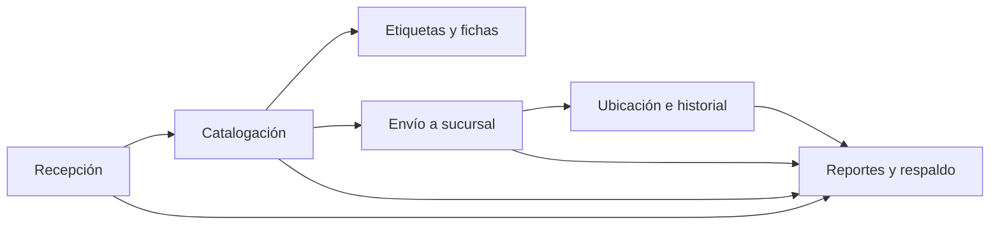
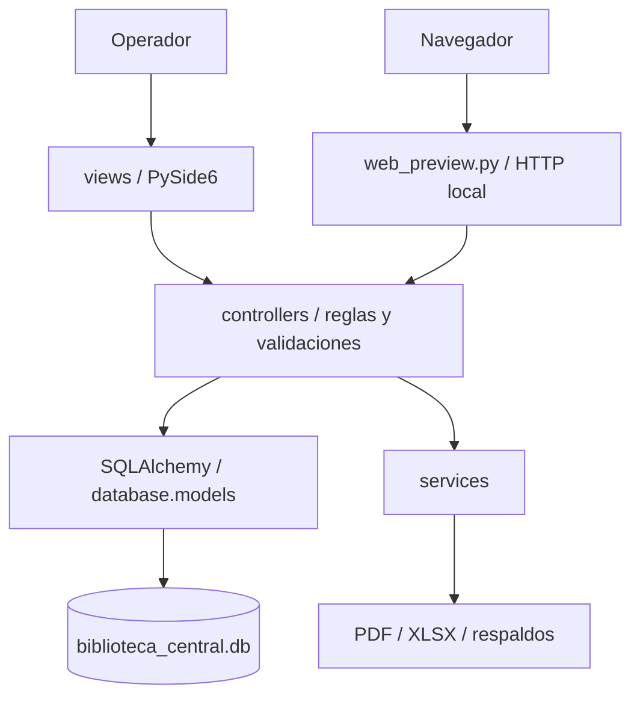

# Documentación técnica y operativa

**Sistema:** Biblioteca Central Rómulo Gallegos  
**Versión documentada:** estado del repositorio revisado el 6 de octubre de 2026  
**Propósito:** describir arquitectura, módulos, datos, controles, operación y evidencias disponibles para mantenimiento y auditoría.  
**Estado:** documentación basada en inspección estática del código y pruebas automatizadas. No constituye certificación ni reemplaza procedimientos aprobados por la institución.

## 1. Resumen del sistema

Aplicación bibliotecaria local para registrar ingresos de libros, catalogarlos, administrar ubicaciones, distribuir materiales a sucursales, generar documentos y consultar reportes. La aplicación principal es de escritorio, construida con PySide6; también incluye una interfaz web de prueba servida por Python. La persistencia se realiza en SQLite mediante SQLAlchemy.

El flujo de trabajo principal es:



La solución funciona localmente y no requiere un servicio de base de datos remoto. El modo web puede abrir la base activa; el modo `--demo` utiliza una base aislada temporal para pruebas. **La vista web sin `--demo` no es de sólo lectura en la implementación actual**: sus rutas autenticadas aceptan escrituras sobre la base configurada. La descripción de sólo lectura en `README.md` no coincide con ese comportamiento; véase A-09.

## 2. Alcance funcional

| Módulo | Funciones disponibles | Componentes principales |
|---|---|---|
| Recepción | Alta, consulta y edición antes de catalogar; número `REG-AAAA-NNNNN`; registro de procedencia y cambios. | `views/recepcion_view.py`, `controllers/recepcion_controller.py` |
| Catalogación | Dewey o LC, sugerencia Cutter, cota manual o automática, rechazo/confirmación de cotas duplicadas. | `views/catalogacion_view.py`, `controllers/catalogacion_controller.py` |
| Fichero | Búsqueda de libros catalogados, fichas y resumen por área; matriz anual I/D/P por libro y sucursal. | `views/fichero_view.py`, `controllers/fichero_controller.py` |
| Etiquetas | PDF de cotas de lomo con ancho y alto configurables; fichas individuales, cuatro por página Letter. | `views/etiquetas_view.py`, `services/pdf_service.py` |
| Distribución | Selección de libros catalogados, validación de destino, creación de envío `ENV-AAAAMMDD-NNN`, actualización de estado/ubicación y generación del control de envío y Nota de Entrega. | `views/distribucion_view.py`, `controllers/distribucion_controller.py` |
| Ubicación | Búsqueda, actualización de biblioteca/sala/estante y consulta del historial de movimientos. | `views/ubicacion_view.py`, `controllers/ubicacion_controller.py` |
| Reportes | Resúmenes e inventarios en PDF/Excel; matriz anual de sucursales por áreas Dewey; exportación de tablas; respaldo de base. | `views/reportes_view.py`, `controllers/reportes_controller.py` |
| Usuarios | Creación, actualización, activación/desactivación y control por rol. | `views/usuarios_view.py`, `controllers/auth_controller.py` |
| Sucursales | Alta, consulta y desactivación, protegiendo la biblioteca central. | `views/bibliotecas_view.py`, `controllers/biblioteca_controller.py` |

## 3. Arquitectura y punto de entrada

La organización sigue un patrón MVC con servicios auxiliares:



- `main.py` crea la aplicación Qt y solicita elegir interfaz de escritorio o web.
- `views/main_window.py` crea la navegación y conecta vistas y controladores. Las páginas de Usuarios y Sucursales sólo se muestran a administradores.
- `database/db_manager.py` crea el motor SQLite, activa las claves foráneas por conexión, crea tablas e inicializa datos base. Su administrador de sesión confirma al salir sin error y revierte ante excepción.
- `database/models.py` declara las entidades SQLAlchemy y las relaciones.
- `services/` contiene creación de PDF, hojas Excel, mini-fichas y respaldo SQLite.
- `web_preview.py` proporciona el servidor de la interfaz web con `ThreadingHTTPServer`; por omisión se utiliza loopback en la ejecución de desarrollo.
- `views/main_view.py`, `models/libro_model.py` y partes de `controllers/libro_controller.py` contienen funcionalidad heredada Tkinter/SQLite. No son la ruta principal iniciada por `main.py`; deben tratarse como código legado y no como fuente de la operación actual.

## 4. Tecnologías y requisitos

| Componente | Tecnología / requisito |
|---|---|
| Lenguaje | Python 3.11 o superior (según `README.md`). |
| Interfaz de escritorio | PySide6 / Qt. |
| Persistencia | SQLite y SQLAlchemy 2.x. |
| Documentos | ReportLab para PDF; openpyxl para Excel. |
| Pruebas | pytest. |
| Empaquetado | PyInstaller `onedir`; se construye por sistema operativo destino. |
| Linux gráfico | Puede requerir runtime OpenGL del sistema, como `libgl1`. |

Las dependencias declaradas están en `requirements.txt`. No hay en el material revisado un lockfile de versiones resueltas ni una política de actualización automatizada de dependencias.

## 5. Instalación, arranque y datos

### Ejecución desde código

```bash
python -m venv .venv
source .venv/bin/activate
python -m pip install -r requirements.txt
python main.py
```

En Windows se activa con `.venv\\Scripts\\activate`.

### Vista web de demostración

```bash
python web_preview.py --demo --port 8766
```

Abrir `http://127.0.0.1:8766`. La base de demostración está en una ruta temporal diferente a la base de operación. El servidor permite escritura en esa base de demostración aislada. Sin `--demo`, tanto el servidor lanzado desde `main.py` como el servidor CLI pueden operar sobre la base indicada y aceptan escrituras autenticadas; no debe usarse como modo de sólo lectura hasta corregir el control.

### Ubicación predeterminada

`config.py` define la carpeta de la aplicación según el directorio del ejecutable cuando está empaquetada, o el del código cuando se ejecuta desde Python. La base es `data/biblioteca_central.db`; los respaldos quedan bajo `data/backups/` o junto a la base configurada. El directorio debe permitir lectura y escritura al usuario que inicia la aplicación.

### Inicio inicial

`DatabaseManager.initialize()` crea tablas, ejecuta el ajuste de esquema existente e inicializa una biblioteca central y la cuenta `admin`. Las credenciales iniciales se publican en `README.md` y el primer ingreso está marcado para cambio obligatorio. Debe completarse ese cambio antes de usar la instalación con datos reales. Véanse los hallazgos F-01 y F-02 en `INFORME_AUDITORIA_SISTEMA.md`.

## 6. Roles y autorización observada

| Rol | Acceso funcional observado |
|---|---|
| Administrador | Operación general; administración de usuarios y sucursales. |
| Bibliotecario | Recepción, catalogación, inventario, etiquetas, ubicación, distribución y reportes. |

La administración de usuarios valida en `AuthController` que el solicitante exista, esté activo y tenga rol administrador. La administración de sucursales y usuarios también comprueba el rol en la API web. El acceso a las vistas de Usuarios y Sucursales se oculta para bibliotecarios.

**Reserva de seguridad:** la obligatoriedad del primer cambio de contraseña se verifica en las interfaces, pero no está impuesta por `AuthController.autenticar` ni por todas las rutas de la API. Una llamada directa a la API puede obtener una sesión mientras `debe_cambiar_clave` sigue activo. El servidor web tampoco está diseñado como servicio web multiusuario endurecido; revisar F-02 y F-04.

## 7. Flujo y reglas de negocio

### Recepción

El usuario registra título y procedencia, además de los metadatos bibliográficos disponibles. La validación rechaza título/procedencia ausentes, años fuera del rango permitido y páginas menores o iguales a cero. Se crea un número de registro con prefijo anual, un evento inicial y una ubicación de recepción. Las ediciones sólo se aceptan antes de catalogar y dejan usuario y fecha de modificación, pero no una copia de cada valor anterior.

### Catalogación y cota

El flujo distingue catálogo Dewey o LC, código de clasificación, Cutter y cota completa. Se comprueba que el libro esté recibido, la clasificación sea admitida y la cota no esté vacía. Si ya existe la misma cota, se solicita confirmar cuando corresponde a un volumen compartido.

La generación automática de cota, añadida al controlador central y conectada tanto a escritorio como a web, ofrece estos criterios:

- Prefijo por orden: menos de 50 páginas (`Foll.`), dimensión mayor de 30 cm (`F`), Referencia (`R`), Infantil (`X`), Juvenil (`J`), Música escrita (`M`).
- Biografía individual/colectiva (`B`/`B2`); ficción novelística, poesía, teatro o ensayo con variante venezolana; para otra no ficción valida Dewey y conserva hasta cinco decimales.
- Cutter basado en el personaje biografiado, primer autor o primera palabra del título si es anónimo o se indican cuatro o más autores. El formulario permite introducir el número de autores para separar nombres de apellidos ambiguos.
- Año obligatorio, volumen/tomo opcional y generación de `ej.2` o posterior ante una cota coincidente. El campo final sigue editable.

**Limitación bibliotecológica:** el código Cutter usado actualmente es una heurística determinista basada en la suma de caracteres del apellido. No consulta una tabla autorizada Cutter-Sanborn ni garantiza una asignación normativa BNV. La nacionalidad, dimensiones, sección, género, personaje biografiado y tomo que se capturan para la generación no se guardan como campos bibliográficos separados; sólo persiste la cota resultante. Es necesaria validación profesional y ver F-05.

### Distribución, ubicación e historial

La distribución exige una sucursal activa, IDs no repetidos y libros existentes catalogados. Dentro de una sesión se crea un envío con código secuencial diario, se asocia a sus libros, cambia el estado a distribuido y se registran ubicaciones y movimientos. Los cambios posteriores de ubicación agregan eventos al historial.

Los eventos de libros permiten reconstruir fases operativas, pero no equivalen a un registro de auditoría integral: no registran inicio de sesión, consulta/exportación, cambios administrativos de usuario, ni valores anteriores y nuevos de todos los campos. Ver F-06.

## 8. Modelo de datos

Las entidades declaradas en `database/models.py` son:

| Tabla | Datos principales | Relación / control relevante |
|---|---|---|
| `libros` | Título, autor, editorial, año, ISBN, edición, idioma, páginas, número opcional de volúmenes, precio unitario opcional, procedencia, estado, cota, Dewey, número de registro y observaciones. | Número de registro único; estado y procedencia restringidos; relación con recepción/catalogación/ubicaciones/movimientos. |
| `recepcion` | Tipo de ingreso, proveedor/donante/institución, observaciones y datos de modificación. | Un registro por libro; usuarios registrador y modificador opcionales. |
| `catalogacion` | Sistema, código, cota completa, Cutter, fecha y catalogador. | Un registro por libro. |
| `bibliotecas` | Nombre, dirección, municipio, encargado, teléfono, email y estado activo. | Nombre único. |
| `ubicaciones` | Libro, biblioteca, tipo, sala, estante y fecha. | Historial por libro; tipos restringidos. |
| `bultos` | Código de envío, biblioteca destino, fecha, cantidad, género/observaciones y creador. | Código único y biblioteca destino requerida. |
| `bulto_libros` | Relaciones entre envío y libro. | Claves foráneas con restricciones de borrado. |
| `movimientos` | Libro, tipo, fecha, origen/destino, usuario y detalle. | Historial operacional asociado al libro. |
| `usuarios` | Usuario, hash, salt, nombre, rol, estado, cambio requerido y fecha de alta. | Usuario único y rol restringido a `admin`/`bibliotecario`. |

SQLite no cifra por sí mismo la base ni los respaldos. El sistema no incluye un control de versiones de esquema; el cambio conocido se aplica con inspección de columnas y `ALTER TABLE`. Ver F-07.

## 9. Controles técnicos existentes

- PBKDF2-HMAC-SHA256 con 310.000 iteraciones y sal aleatoria por usuario (`database/seed_data.py`).
- Comparación de hash con `hmac.compare_digest`.
- Longitud mínima de contraseña nueva: diez caracteres.
- Verificación de usuario activo antes de autenticar y al resolver sesiones web.
- Autorización administrativa centralizada para gestionar cuentas.
- Restricciones SQLAlchemy/SQLite y claves foráneas activadas en conexiones.
- Sesiones SQLAlchemy con commit y rollback ante excepciones.
- La cookie de sesión web se establece `HttpOnly` y `SameSite=Strict`.
- La interfaz web escapa texto al renderizar contenido textual en tablas y usa una base aislada para la demostración.
- El servidor web predeterminado se usa en loopback desde los puntos de entrada documentados.

Estos controles reducen riesgos, pero no sustituyen autorización de cada operación sensible, cifrado de datos, seguridad de red ni auditoría completa. La cookie no tiene `Secure`, expiración ni renovación; si el servidor se enlaza a una interfaz de red, el tráfico HTTP no está cifrado. Ver F-04.

## 10. Exportaciones y respaldos

- Excel de inventario y reportes se construye con openpyxl.
- Existe exportación de todas las tablas reflejadas del esquema. Incluye `usuarios`, con `password_hash` y `salt`; en escritorio la acción está en una vista de reportes común a ambos roles. Ver F-01.
- Los valores de usuario se escriben directamente en celdas Excel. Una entrada iniciada por `=` se interpreta como fórmula por openpyxl/Excel; ver F-03.
- Los PDF incluyen cotas, fichas, reportes y documentos de envío.
- `BackupService` usa la API de backup SQLite, guarda archivos locales sin cifrar y rota los siete más recientes.
- La aplicación intenta crear backup al cierre y ofrece creación manual.
- Las pruebas verifican integridad SQLite (`PRAGMA integrity_check`) en una copia creada y la rotación; no se encontró un flujo de restauración operativa probado ni política externa/inmutable.

## 11. Pruebas y estado de verificación

Pruebas encontradas y recolectadas con pytest: **18 casos**.

| Archivo | Cobertura principal |
|---|---|
| `tests/test_database_architecture.py` | Esquema, datos iniciales, claves foráneas y migraciones de clasificación, precio/volúmenes y municipio. |
| `tests/test_recepcion_mvc.py` | Recepción, validación, corrección y respaldo de la implementación MVC previa. |
| `tests/test_services_and_branches.py` | PDF, Excel, backup/rotación y gestión de sucursales. |
| `tests/test_system_workflow.py` | Flujo de recepción a distribución, movimientos, reportes y reglas de generación de cota. |
| `tests/test_operational_readiness.py` | Catálogo sintético aislado, umbral de búsqueda, PDF paginado, restauración SQLite y API web con cambio inicial de clave/logout. |

La suite ampliada se ejecuta con `pytest -q`; sus datos se crean en rutas temporales y no modifican la base institucional. La prueba de restauración abre el respaldo en un archivo SQLite nuevo y vuelve a inicializarlo con SQLAlchemy. La prueba de catálogo mide una búsqueda contra 300 registros sintéticos con objetivo local menor a dos segundos y genera un PDF tabular con 300 filas; el tiempo es una referencia de este entorno, no una garantía para los equipos de destino.

La inspección confirma pruebas automatizadas de unidad/flujo y recuperación aislada, pero no métricas de cobertura, pipeline CI, pruebas de carga en equipos finales, pruebas de penetración, instalación productiva, pruebas de aceptación institucional ni validación física de impresión. La inicialización visual de Qt tampoco se valida en este entorno porque falta la biblioteca de sistema `libGL.so.1`; no se modificó ni se intentó instalar software en el equipo productivo.

## 12. Plan de pruebas previo a la puesta en funcionamiento

Para autorizar el uso en la Biblioteca Central se recomienda superar pruebas automatizadas, pruebas de operación en los equipos reales y aceptación formal del personal. La suite automatizada es necesaria, pero no sustituye las comprobaciones de instalación, datos, impresión y procedimientos cotidianos.

| Conjunto | Qué probar en este sistema | Criterio de aprobación |
|---|---|---|
| 1. Instalación y arranque | Instalar en los equipos previstos; iniciar y cerrar la aplicación; verificar la creación/reconocimiento de SQLite y reabrirla. | Arranque y cierre sin errores; base y carpetas en las ubicaciones previstas; no depende de rutas del entorno de desarrollo. |
| 2. Flujo bibliotecario integral | Probar recepción, edición permitida, catalogación Dewey/Cutter, distribución, ubicación, fichero y reportes con casos representativos. | Datos conservados entre módulos; estados, ubicaciones y movimientos coherentes con las operaciones. |
| 3. Validación de datos | Probar campos obligatorios/opcionales, formatos inválidos, duplicados, límites y libros sin precio, volúmenes o código Dewey. | Datos inválidos rechazados con mensajes claros; campos opcionales vacíos no bloquean el flujo ni producen información engañosa. |
| 4. Base de datos y migraciones | Abrir una copia de una base anterior; probar migraciones de municipio, precio, volúmenes y clasificación; revisar claves y relaciones. | Migración sin pérdida de registros y relaciones consistentes entre libros, ubicaciones, sucursales y bultos. |
| 5. Usuarios y permisos | Probar cambio inicial de contraseña, contraseñas incorrectas, usuarios inactivos y operaciones de administrador/bibliotecario. | Cada rol puede realizar únicamente las operaciones autorizadas; errores de acceso no modifican datos. |
| 6. PDF, impresión y exportaciones | Abrir e imprimir los formatos; comprobar tamaño/orientación, márgenes, saltos, textos largos, acentos, totales y cortes. | Documentos correctos para el libro/envío seleccionado y legibles en impresoras reales. Confirmar cuatro fichas por hoja Carta y que las matrices horizontales no se recorten. |
| 7. Respaldo y recuperación | Crear un respaldo, restaurarlo en una ubicación de prueba y abrir el sistema con la copia restaurada. | Restauración conserva registros y relaciones; queda determinado cuánto trabajo podría perderse desde el respaldo anterior. Verificar una restauración real, no sólo la existencia del archivo. |
| 8. Rendimiento y uso normal | Probar búsquedas, listados, PDF y apertura con un volumen de registros cercano al previsto; probar en los equipos de destino. | Tiempos aceptables para el personal y sin bloqueos. Como objetivo inicial a medir, no como norma oficial, se puede fijar búsqueda/listado menor a 2 segundos con el volumen previsto. |
| 9. Aceptación de usuarios | Bibliotecarios ejecutan tareas diarias con datos de ensayo y cotejan documentos con formatos aprobados. | Personal designado confirma que pantallas, términos, formularios y documentos sirven para el procedimiento real; excepciones documentadas. |

### Casos que deben incluirse

- Ingresos de donación, compra y Biblioteca Nacional; título con varios volúmenes y otro con campos opcionales vacíos.
- Libro distribuido a una sucursal, cambio posterior de ubicación y verificación de que se muestra la ubicación vigente.
- Envío con datos completos y otro sin precio o volumen. Los totales deben indicar con claridad si son incompletos.
- Ficha individual con 1, 4 y 5 libros seleccionados, verificando espacios vacíos y página adicional.
- Matriz por sucursal con nombres que coinciden con la lista institucional y con sucursales adicionales.
- Migración de una copia anterior de la base. No ejecutar una prueba inicial sobre la única base institucional.
- Cierre inesperado y reapertura o recuperación desde un respaldo.
- Impresión de muestra aprobada por la persona responsable de los formatos. Logotipos y categorías no almacenadas deben revisarse con la institución; generar un PDF no basta para validarlos.

### Condiciones mínimas para autorizar el uso

1. Pruebas automatizadas verdes en la versión candidata.
2. Sin defectos críticos que impidan registrar, consultar, distribuir o recuperar información.
3. Restauración real desde respaldo probada y documentada.
4. Documentos revisados e impresos en los equipos de destino.
5. Prueba de aceptación completada por bibliotecarios designados con datos de ensayo.
6. Procedimiento establecido para respaldo, recuperación, soporte y reporte de errores.
7. Formatos y datos que aún no existen en el modelo aprobados por la institución.

Este plan es una recomendación técnica, no una certificación ni garantía de cumplimiento normativo. Se recomienda iniciar con un piloto de datos controlados y un grupo pequeño de usuarios, mantener respaldada la base y acordar cómo volver al procedimiento anterior si surge un problema. Además, antes de operar con datos sensibles, deben atenderse los hallazgos abiertos del `INFORME_AUDITORIA_SISTEMA.md`, en especial los relativos a exposición de credenciales y autorización.

## 13. Operación segura recomendada

1. Instalar y ejecutar con una cuenta del sistema operativo dedicada, con acceso de escritura sólo a la carpeta de datos.
2. Cambiar la contraseña inicial antes de cargar datos reales y no difundirla fuera del procedimiento inicial.
3. Mantener la vista web en `127.0.0.1`; no usar `--host 0.0.0.0` ni exponer el puerto en una red sin TLS, autenticación reforzada y control operativo.
4. Restringir exportaciones y respaldos a personal autorizado; tratar XLSX y archivos `.db` como datos sensibles.
5. Mantener copias adicionales cifradas y separadas del dispositivo de trabajo, con restauraciones de prueba documentadas.
6. Probar una actualización sobre copia de base antes de aplicar cambios a producción.
7. Revisar y validar manualmente cada cota generada, en particular Cutter y clasificación temática.

## 14. Referencias internas

- [README.md](README.md): instalación, primer acceso, ejecución, módulos y empaquetado.
- [DESCRIPCION_PROYECTO.md](DESCRIPCION_PROYECTO.md): descripción del proyecto y objetivos.
- [TODO.md](TODO.md): tareas de publicación pendientes.
- [requirements.txt](requirements.txt): dependencias declaradas.
- [INFORME_AUDITORIA_SISTEMA.md](INFORME_AUDITORIA_SISTEMA.md): hallazgos, severidad y plan de remediación.
