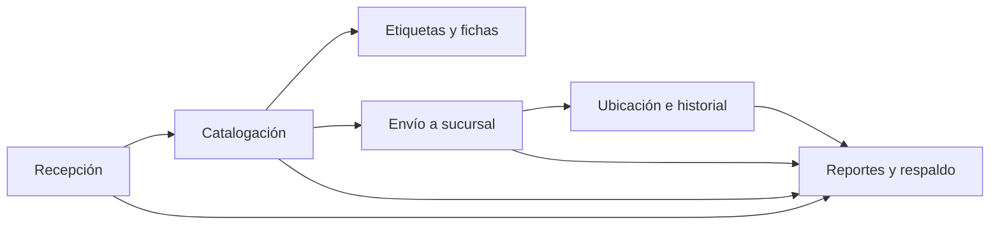
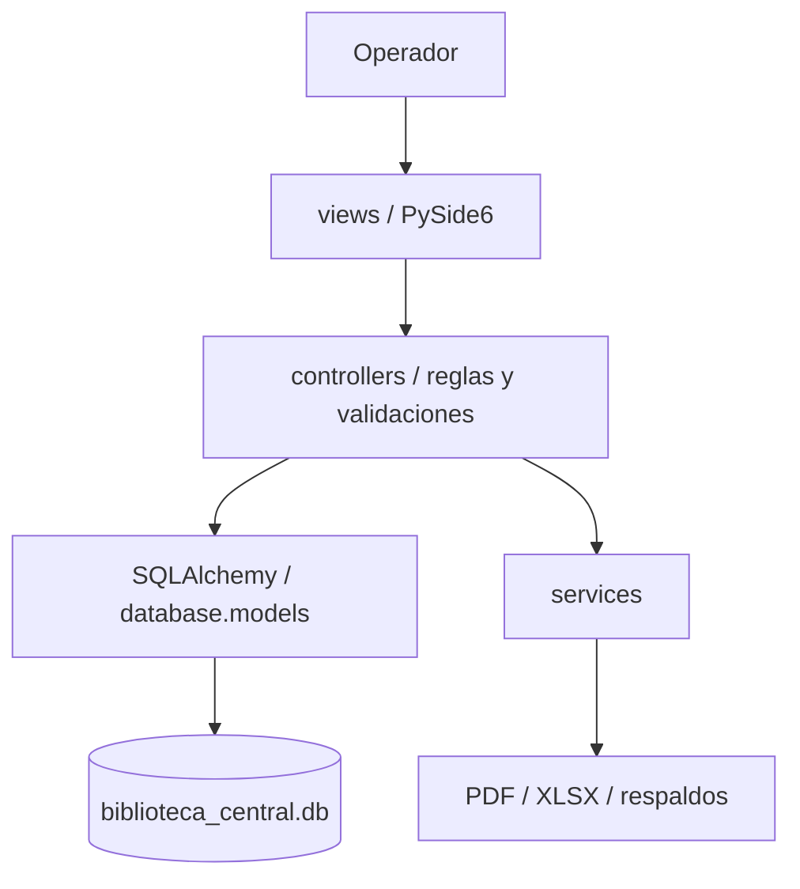

# Documentación técnica y operativa

**Sistema:** Biblioteca Central Rómulo Gallegos  
**Versión documentada:** rama `mejora-sistema-en-pruebas`, estado revisado el 6 de octubre de 2026
**Propósito:** describir arquitectura, módulos, datos, controles, operación y evidencias disponibles para mantenimiento y auditoría.  
**Estado:** documentación basada en inspección estática del código y pruebas automatizadas. No constituye certificación ni reemplaza procedimientos aprobados por la institución.

## 1. Resumen del sistema

Aplicación bibliotecaria local exclusivamente de escritorio para registrar ingresos de libros, catalogarlos, administrar ubicaciones, distribuir materiales a sucursales, generar documentos y consultar reportes. La interfaz usa PySide6 y la persistencia SQLite mediante SQLAlchemy. No se incluye servidor HTTP ni cliente web.

El flujo de trabajo principal es:



La solución funciona localmente y no requiere un servicio de base de datos remoto. `main.py` inicia directamente la autenticación de escritorio y después presenta los módulos permitidos para el rol activo. Las pruebas automatizadas operan con bases SQLite temporales; no cargan datos ficticios en la base de uso.

## 2. Alcance funcional

| Módulo | Funciones disponibles | Componentes principales |
|---|---|---|
| Recepción | Alta, consulta y edición antes de catalogar; número `REG-AAAA-NNNNN`; registro de procedencia y cambios. | `views/recepcion_view.py`, `controllers/recepcion_controller.py` |
| Catalogación | Dewey o LC, sugerencia Cutter, cota manual o automática, rechazo/confirmación de cotas duplicadas. | `views/catalogacion_view.py`, `controllers/catalogacion_controller.py` |
| Fichero | Búsqueda de libros catalogados, resumen de inventario y matriz de control I/D/P por título y sucursal. | `views/fichero_view.py`, `controllers/fichero_controller.py` |
| Etiquetas y fichas | PDF de cotas de lomo con dimensiones ajustables y ficha catalográfica individual en cuadrícula de 2×2, cuatro fichas por página Letter. | `views/etiquetas_view.py`, `controllers/etiqueta_controller.py`, `services/pdf_service.py` |
| Distribución | Envíos `ENV-AAAAMMDD-NNN`, validación de destino y estado, ubicación/movimientos, Control de Envío SNBP, Nota de Entrega editable y mini-ficha PDF. | `views/distribucion_view.py`, `controllers/distribucion_controller.py` |
| Ubicación | Búsqueda, actualización de biblioteca/sala/estante y consulta del historial de movimientos. | `views/ubicacion_view.py`, `controllers/ubicacion_controller.py` |
| Reportes | Resúmenes e inventarios PDF/Excel; matriz anual por biblioteca/área Dewey; exportación integral exclusivamente administrativa; respaldo SQLite con comprobación de integridad. | `views/reportes_view.py`, `controllers/reportes_controller.py` |
| Auditoría | Registra inicios de sesión, cambios de clave, acciones de administración, exportaciones y respaldos. | `database/models.py`, `services/audit_service.py` |
| Usuarios | Creación, actualización, activación/desactivación y control por rol. | `views/usuarios_view.py`, `controllers/auth_controller.py` |
| Sucursales | Alta, consulta y desactivación, protegiendo la biblioteca central. | `views/bibliotecas_view.py`, `controllers/biblioteca_controller.py` |

### Formatos de salida institucional

| Documento | Módulo | Diseño y fuentes de datos |
|---|---|---|
| Control de Envío al Sistema Nacional de Bibliotecas Públicas | Distribución | PDF Letter vertical; libros vinculados al bulto, procedencia, volúmenes y precios opcionales; indica cuando datos incompletos limitan los totales. |
| Nota de Entrega | Distribución | PDF Letter vertical; completa sucursal, dirección, municipio, fecha y volúmenes del envío; operador verifica nombre y cédula de quien recibe antes de generar. |
| Matriz de Control por Sucursales | Fichero | PDF Letter vertical; una fila por sucursal, marcas de ingreso/disponibilidad/préstamo basadas en estado y ubicación vigente. |
| Ficha Catalográfica Individual | Etiquetas y Fichas | PDF Letter vertical; cuadrícula 2×2 (cuatro fichas exactas por página) y líneas punteadas para recorte; la ciudad queda para completar si no está en el modelo. |
| Resumen de Distribución por Áreas de Conocimiento | Reportes | PDF Letter horizontal, separado en páginas para legibilidad; títulos y volúmenes por biblioteca/rango Dewey. |
| Cotas y mini-ficha | Etiquetas / Distribución | PDF con tamaño de etiqueta configurable y ficha breve del envío. |

La matriz de áreas aproxima Biografías mediante Dewey 920–929 y Publicaciones Periódicas con 050–059. Publicaciones Oficiales y No Bibliográfico requieren clasificación en el modelo y no deben inferirse por el nombre o contenido de un título. Los logotipos institucionales no están incorporados como recursos gráficos en el repositorio; se imprime membrete de texto. La aprobación institucional y prueba física de formatos continúan pendientes.

## 3. Arquitectura y punto de entrada

La organización sigue un patrón MVC con servicios auxiliares:



- `main.py` crea la aplicación Qt y abre el flujo de autenticación de escritorio; no ofrece un selector web.
- `views/main_window.py` crea la navegación y conecta vistas y controladores. Las páginas de Usuarios y Sucursales sólo se muestran a administradores.
- `views/navigation.py` registra y selecciona widgets que pertenecen al `QStackedWidget`; las pruebas unitarias de navegación no necesitan cargar el runtime gráfico.
- `database/db_manager.py` crea el motor SQLite, activa las claves foráneas por conexión, crea tablas e inicializa datos base. Su administrador de sesión confirma al salir sin error y revierte ante excepción.
- `database/models.py` declara las entidades SQLAlchemy y las relaciones.
- `services/` contiene creación de PDF, hojas Excel, mini-fichas y respaldo SQLite.
- `views/main_view.py`, `models/libro_model.py` y partes de `controllers/libro_controller.py` contienen funcionalidad heredada Tkinter/SQLite. No son la ruta principal iniciada por `main.py`; deben tratarse como código legado y no como fuente de la operación actual.

## 4. Tecnologías y requisitos

| Componente | Tecnología / requisito |
|---|---|
| Lenguaje | Python 3.11 o superior (según `README.md`). |
| Interfaz de escritorio | PySide6 / Qt. |
| Persistencia | SQLite y SQLAlchemy 2.x. |
| Documentos | ReportLab para PDF; openpyxl para Excel. |
| Pruebas | pytest. |
| Empaquetado | PyInstaller `onedir`; se construye por sistema operativo destino. |
| Linux gráfico | Puede requerir runtime OpenGL del sistema, como `libgl1`. |

Las dependencias declaradas están en `requirements.txt`. No hay en el material revisado un lockfile de versiones resueltas ni una política de actualización automatizada de dependencias.

## 5. Instalación, arranque y datos

### Ejecución desde código

```bash
python -m venv .venv
source .venv/bin/activate
python -m pip install -r requirements.txt
python main.py
```

En Windows se activa con `.venv\\Scripts\\activate`.

La ejecución del comando abre directamente la ventana de inicio de sesión PySide6. Si se cancela el inicio, la conexión a SQLite se cierra sin abrir la ventana principal.

### Ubicación predeterminada

`config.py` define la carpeta de la aplicación según el directorio del ejecutable cuando está empaquetada, o el del código cuando se ejecuta desde Python. La base es `data/biblioteca_central.db`; los respaldos quedan bajo `data/backups/` o junto a la base configurada. El directorio debe permitir lectura y escritura al usuario que inicia la aplicación.

### Inicio inicial

`DatabaseManager.initialize()` crea tablas (incluida `auditoria_log`), ejecuta ajustes de esquema existentes e inicializa una biblioteca central y la cuenta `admin`. La credencial bootstrap es conocida y se requiere cambiarla en el primer ingreso. Debe completarse ese cambio y no reutilizar la clave inicial antes de cargar datos reales.

## 6. Roles y autorización observada

| Rol | Acceso funcional observado |
|---|---|
| Administrador | Operación general; administración de usuarios y sucursales. |
| Bibliotecario | Recepción, catalogación, inventario, etiquetas, ubicación, distribución y reportes. |

La administración de usuarios valida en `AuthController` que el solicitante exista, esté activo, tenga rol administrador y no tenga pendiente cambio obligatorio de clave. El acceso a las vistas de Usuarios y Sucursales se oculta para bibliotecarios y el controlador vuelve a comprobar el rol al ejecutar operaciones administrativas.

**Control y reserva:** el diálogo de acceso impide aceptar la sesión operativa hasta completar el cambio obligatorio de contraseña. `AuthController.acceso_operativo_permitido()` permite comprobar en la capa de lógica que la cuenta siga activa y no tenga un cambio pendiente. La interfaz completa no se pudo ejecutar visualmente en este entorno por falta de `libGL.so.1`.

## 7. Flujo y reglas de negocio

### Recepción

El usuario registra título y procedencia, además de los metadatos bibliográficos disponibles. La validación rechaza título/procedencia ausentes, años fuera del rango permitido y páginas menores o iguales a cero. Se crea un número de registro con prefijo anual, un evento inicial y una ubicación de recepción. Las ediciones sólo se aceptan antes de catalogar y dejan usuario y fecha de modificación, pero no una copia de cada valor anterior.

### Catalogación y cota

El flujo distingue catálogo Dewey o LC, código de clasificación, Cutter y cota completa. Se comprueba que el libro esté recibido, la clasificación sea admitida y la cota no esté vacía. Si ya existe la misma cota, se solicita confirmar cuando corresponde a un volumen compartido.

La generación automática de cota, conectada al flujo de escritorio, ofrece estos criterios:

- Prefijo por orden: menos de 50 páginas (`Foll.`), dimensión mayor de 30 cm (`F`), Referencia (`R`), Infantil (`X`), Juvenil (`J`), Música escrita (`M`).
- Biografía individual/colectiva (`B`/`B2`); ficción novelística, poesía, teatro o ensayo con variante venezolana; para otra no ficción valida Dewey y conserva hasta cinco decimales.
- Cutter basado en el personaje biografiado, primer autor o primera palabra del título si es anónimo o se indican cuatro o más autores. El formulario permite introducir el número de autores para separar nombres de apellidos ambiguos.
- Año obligatorio, volumen/tomo opcional y generación de `ej.2` o posterior ante una cota coincidente. El campo final sigue editable.

**Limitación bibliotecológica:** el código Cutter usado actualmente es una heurística determinista basada en la suma de caracteres del apellido. No consulta una tabla autorizada Cutter-Sanborn ni garantiza una asignación normativa BNV. La nacionalidad, dimensiones, sección, género, personaje biografiado y tomo que se capturan para la generación no se guardan como campos bibliográficos separados; sólo persiste la cota resultante. Es necesaria validación profesional y ver A-05.

### Distribución, ubicación e historial

La distribución exige una sucursal activa, IDs no repetidos y libros existentes catalogados. Dentro de una sesión se crea un envío con código secuencial diario, se asocia a sus libros, cambia el estado a distribuido y se registran ubicaciones y movimientos. Los cambios posteriores de ubicación agregan eventos al historial.

Los eventos de libros permiten reconstruir fases operativas. La bitácora `auditoria_log` cubre login correcto/incorrecto, cambios de clave, acciones administrativas, exportaciones y respaldos; no registra cada consulta ni el antes/después de todos los cambios bibliográficos. Ver hallazgo A-07 en `INFORME_AUDITORIA_SISTEMA.md`.

## 8. Modelo de datos

Las entidades declaradas en `database/models.py` son:

| Tabla | Datos principales | Relación / control relevante |
|---|---|---|
| `libros` | Título, autor, editorial, año, ISBN, edición, idioma, páginas, número opcional de volúmenes, precio unitario opcional, procedencia, estado, cota, Dewey, número de registro y observaciones. | Número de registro único; estado y procedencia restringidos; relación con recepción/catalogación/ubicaciones/movimientos. |
| `recepcion` | Tipo de ingreso, proveedor/donante/institución, observaciones y datos de modificación. | Un registro por libro; usuarios registrador y modificador opcionales. |
| `catalogacion` | Sistema, código, cota completa, Cutter, fecha y catalogador. | Un registro por libro. |
| `bibliotecas` | Nombre, dirección, municipio, encargado, teléfono, email y estado activo. | Nombre único. |
| `ubicaciones` | Libro, biblioteca, tipo, sala, estante y fecha. | Historial por libro; tipos restringidos. |
| `bultos` | Código de envío, biblioteca destino, fecha, cantidad, género/observaciones y creador. | Código único y biblioteca destino requerida. |
| `bulto_libros` | Relaciones entre envío y libro. | Claves foráneas con restricciones de borrado. |
| `movimientos` | Libro, tipo, fecha, origen/destino, usuario y detalle. | Historial operacional asociado al libro. |
| `usuarios` | Usuario, hash, salt, nombre, rol, estado, cambio requerido y fecha de alta. | Usuario único y rol restringido a `admin`/`bibliotecario`. |
| `auditoria_log` | Fecha/hora local del host, usuario opcional, acción, origen y detalle. | Clave foránea `SET NULL`; restringe acciones a login, cambio de clave, exportación, respaldo y acciones administrativas. No está diseñada como bitácora inmutable. |

SQLite no cifra por sí mismo la base ni los respaldos. El sistema no incluye migraciones versionadas; los ajustes existentes se aplican con inspección de columnas y `ALTER TABLE`. La tabla de auditoría se crea con `create_all` al inicializar la base.

## 9. Controles técnicos existentes

- PBKDF2-HMAC-SHA256 con 310.000 iteraciones y sal aleatoria por usuario (`database/seed_data.py`).
- Comparación de hash con `hmac.compare_digest`.
- Longitud mínima de contraseña nueva: diez caracteres.
- Verificación de usuario activo antes de autenticar.
- Autorización administrativa centralizada para gestionar cuentas.
- Restricciones SQLAlchemy/SQLite y claves foráneas activadas en conexiones.
- Sesiones SQLAlchemy con commit y rollback ante excepciones.
- La navegación de escritorio conserva referencias a las páginas `QScrollArea` añadidas al `QStackedWidget`; una prueba unitaria cubre la selección de página y el estado de botones.
- `auditoria_log` registra inicios de sesión, cambios de clave, acciones administrativas, exportaciones y respaldos.

Estos controles reducen riesgos, pero no sustituyen autorización de cada operación sensible, cifrado de datos ni auditoría completa. La base y los respaldos SQLite no están cifrados; ver hallazgos A-06 y A-07 en `INFORME_AUDITORIA_SISTEMA.md`.

## 10. Exportaciones y respaldos

- Excel de inventario y reportes se construye con openpyxl.
- La exportación integral de tablas requiere autorización administrativa; `password_hash` y `salt` se excluyen tanto de hojas Excel como de tablas PDF. Ver A-01.
- Los textos Excel que comienzan por `=`, `+`, `-` o `@` tras espacios/control inicial se neutralizan y se fuerzan a tipo texto. Ver A-03.
- Los PDF incluyen cotas, fichas, reportes y documentos de envío.
- `BackupService` usa la API de backup SQLite, valida `PRAGMA integrity_check`, guarda archivos locales sin cifrar y rota los siete más recientes.
- La aplicación intenta crear backup al cierre y ofrece creación manual.
- La bitácora guarda eventos de autenticación, cambio de contraseña, administración de cuentas/sucursales, exportación y respaldo; no se guarda material de autenticación.
- Una prueba automatizada restaura una copia a otro archivo temporal, valida integridad y relaciones y vuelve a abrirla con SQLAlchemy. La aplicación de escritorio no ofrece todavía un asistente de restauración; no hay política institucional de copia externa/inmutable.

## 11. Pruebas y estado de verificación

La última ejecución de `pytest -v` recolectó 24 pruebas y aprobó las 24, sin fallos.

| Archivo | Cobertura principal |
|---|---|
| `tests/test_database_architecture.py` | Esquema y datos iniciales, clave foránea de auditoría, claves foráneas generales y migraciones de clasificación, precio/volúmenes y municipio. |
| `tests/test_recepcion_mvc.py` | Recepción, validación, corrección y respaldo de la implementación MVC previa. |
| `tests/test_services_and_branches.py` | PDF, Excel, backup/rotación y gestión de sucursales. |
| `tests/test_system_workflow.py` | Flujo de recepción a distribución, movimientos, reportes y reglas de generación de cota. |
| `tests/test_operational_readiness.py` | Catálogo sintético aislado, umbral de búsqueda, PDF paginado y restauración SQLite. |
| `tests/test_international_audit.py` | Bloqueo por cambio obligatorio de clave en el controlador, exportación XLSX/PDF sin secretos y protegida contra fórmulas, claves foráneas, auditoría y validación del respaldo. |
| `tests/test_desktop_navigation.py` | Selección de páginas del stack y comprobación de que el entrypoint conserva únicamente el flujo de escritorio. |

La suite ampliada se ejecuta con `pytest -v`; las pruebas usan rutas temporales y no modifican la base institucional. La prueba de restauración abre el respaldo en un archivo SQLite nuevo y vuelve a inicializarlo con SQLAlchemy. La prueba de catálogo mide una búsqueda contra 300 registros sintéticos con objetivo local menor a dos segundos y genera un PDF tabular con 300 filas; el tiempo es una referencia de este entorno, no una garantía para los equipos de destino. El respaldo valida automáticamente `PRAGMA integrity_check` antes de reportar éxito.

La inspección confirma pruebas automatizadas de unidad/flujo, recuperación aislada y controles de exportación/autorización, pero no métricas de cobertura, pipeline CI, pruebas de carga en equipos finales, pruebas de penetración, instalación productiva, pruebas de aceptación institucional ni validación física de impresión. La inicialización visual de Qt tampoco se valida en este entorno porque falta la biblioteca de sistema `libGL.so.1`; no se modificó ni se intentó instalar software en el equipo productivo.

## 12. Plan de pruebas previo a la puesta en funcionamiento

Para autorizar el uso en la Biblioteca Central se recomienda superar pruebas automatizadas, pruebas de operación en los equipos reales y aceptación formal del personal. La suite automatizada es necesaria, pero no sustituye las comprobaciones de instalación, datos, impresión y procedimientos cotidianos.

| Conjunto | Qué probar en este sistema | Criterio de aprobación |
|---|---|---|
| 1. Instalación y arranque | Instalar en los equipos previstos; iniciar y cerrar la aplicación; verificar la creación/reconocimiento de SQLite y reabrirla. | Arranque y cierre sin errores; base y carpetas en las ubicaciones previstas; no depende de rutas del entorno de desarrollo. |
| 2. Flujo bibliotecario integral | Probar recepción, edición permitida, catalogación Dewey/Cutter, distribución, ubicación, fichero y reportes con casos representativos. | Datos conservados entre módulos; estados, ubicaciones y movimientos coherentes con las operaciones. |
| 3. Validación de datos | Probar campos obligatorios/opcionales, formatos inválidos, duplicados, límites y libros sin precio, volúmenes o código Dewey. | Datos inválidos rechazados con mensajes claros; campos opcionales vacíos no bloquean el flujo ni producen información engañosa. |
| 4. Base de datos y migraciones | Abrir una copia de una base anterior; probar migraciones de municipio, precio, volúmenes y clasificación; revisar claves y relaciones. | Migración sin pérdida de registros y relaciones consistentes entre libros, ubicaciones, sucursales y bultos. |
| 5. Usuarios y permisos | Probar cambio inicial de contraseña, contraseñas incorrectas, usuarios inactivos y operaciones de administrador/bibliotecario. | Cada rol puede realizar únicamente las operaciones autorizadas; errores de acceso no modifican datos. |
| 6. PDF, impresión y exportaciones | Abrir e imprimir los formatos; comprobar tamaño/orientación, márgenes, saltos, textos largos, acentos, totales y cortes. | Documentos correctos para el libro/envío seleccionado y legibles en impresoras reales. Confirmar cuatro fichas por hoja Carta y que las matrices horizontales no se recorten. |
| 7. Respaldo y recuperación | Crear un respaldo, restaurarlo en una ubicación de prueba y abrir el sistema con la copia restaurada. | Restauración conserva registros y relaciones; queda determinado cuánto trabajo podría perderse desde el respaldo anterior. Verificar una restauración real, no sólo la existencia del archivo. |
| 8. Rendimiento y uso normal | Probar búsquedas, listados, PDF y apertura con un volumen de registros cercano al previsto; probar en los equipos de destino. | Tiempos aceptables para el personal y sin bloqueos. Como objetivo inicial a medir, no como norma oficial, se puede fijar búsqueda/listado menor a 2 segundos con el volumen previsto. |
| 9. Aceptación de usuarios | Bibliotecarios ejecutan tareas diarias con datos de ensayo y cotejan documentos con formatos aprobados. | Personal designado confirma que pantallas, términos, formularios y documentos sirven para el procedimiento real; excepciones documentadas. |

### Casos que deben incluirse

- Ingresos de donación, compra y Biblioteca Nacional; título con varios volúmenes y otro con campos opcionales vacíos.
- Libro distribuido a una sucursal, cambio posterior de ubicación y verificación de que se muestra la ubicación vigente.
- Envío con datos completos y otro sin precio o volumen. Los totales deben indicar con claridad si son incompletos.
- Ficha individual con 1, 4 y 5 libros seleccionados, verificando espacios vacíos y página adicional.
- Matriz por sucursal con nombres que coinciden con la lista institucional y con sucursales adicionales.
- Migración de una copia anterior de la base. No ejecutar una prueba inicial sobre la única base institucional.
- Cierre inesperado y reapertura o recuperación desde un respaldo.
- Impresión de muestra aprobada por la persona responsable de los formatos. Logotipos y categorías no almacenadas deben revisarse con la institución; generar un PDF no basta para validarlos.

### Condiciones mínimas para autorizar el uso

1. Pruebas automatizadas verdes en la versión candidata.
2. Sin defectos críticos que impidan registrar, consultar, distribuir o recuperar información.
3. Restauración real desde respaldo probada y documentada.
4. Documentos revisados e impresos en los equipos de destino.
5. Prueba de aceptación completada por bibliotecarios designados con datos de ensayo.
6. Procedimiento establecido para respaldo, recuperación, soporte y reporte de errores.
7. Formatos y datos que aún no existen en el modelo aprobados por la institución.

Este plan es una recomendación técnica, no una certificación ni garantía de cumplimiento normativo. Se recomienda iniciar con un piloto de datos controlados y un grupo pequeño de usuarios, mantener respaldada la base y acordar cómo volver al procedimiento anterior si surge un problema. Antes de operar con datos sensibles, atiende los riesgos residuales descritos en `INFORME_AUDITORIA_SISTEMA.md`, incluyendo credencial bootstrap conocida y controles institucionales de custodia.

## 13. Operación segura recomendada

1. Instalar y ejecutar con una cuenta del sistema operativo dedicada, con acceso de escritura sólo a la carpeta de datos.
2. Cambiar la contraseña inicial `admin123` antes de cargar datos reales y no difundirla fuera del procedimiento inicial.
3. Restringir exportaciones y respaldos a personal autorizado; tratar XLSX y archivos `.db` como datos sensibles.
4. Mantener copias adicionales cifradas y separadas del dispositivo de trabajo, con restauraciones de prueba documentadas.
5. Probar una actualización sobre copia de base antes de aplicarla a producción.
6. Revisar y validar manualmente cada cota generada, en particular Cutter y clasificación temática.

## 14. Referencias internas

- [README.md](README.md): instalación, primer acceso, ejecución, módulos y empaquetado.
- [DESCRIPCION_PROYECTO.md](DESCRIPCION_PROYECTO.md): descripción del proyecto y objetivos.
- [TODO.md](TODO.md): tareas de publicación pendientes y aceptación.
- [requirements.txt](requirements.txt): dependencias declaradas.
- [INFORME_AUDITORIA_SISTEMA.md](INFORME_AUDITORIA_SISTEMA.md): hallazgos, severidad y plan de remediación.
- [REPORTE_TECNICO_AUDITORIA_OWASP_ISO.md](REPORTE_TECNICO_AUDITORIA_OWASP_ISO.md): cambios verificados, inventario de archivos, resultados de pruebas y límites de alineación.
- `views/manual_view.py`: manual integrado en la aplicación de escritorio.
